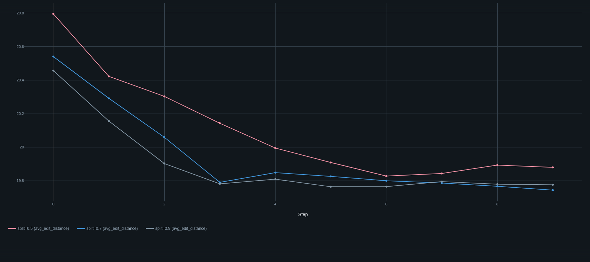
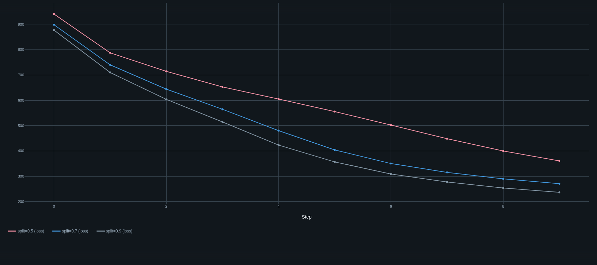
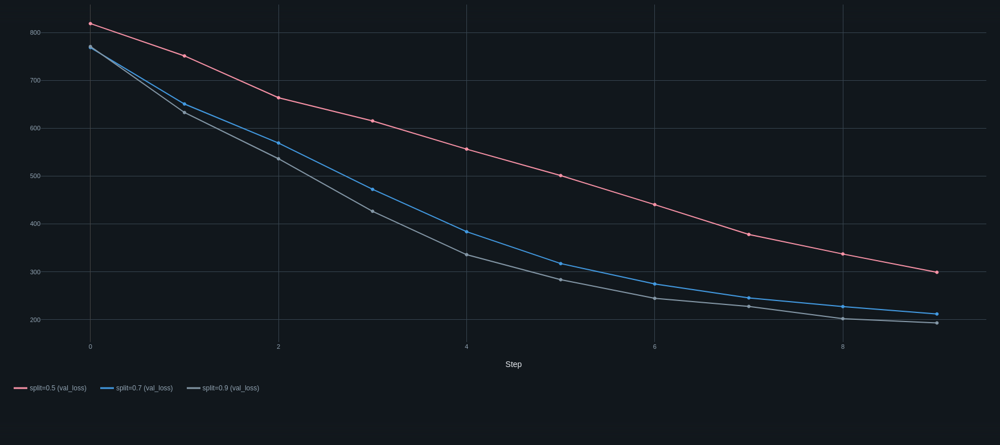

## Directory structure

```
├── handwriting_classifier.ipynb
├── log.log
├── mlartifacts
│   └── 754929904376585580    #correspond to the 3 runs of the experiment
│       ├── 6ae3d46d42ac411c9522faa90bd0217a
│       ├── a6bd709b2650409baf5fe49c279f4839
│       └── d9b535d6de1f41f2bed0ec2306792dfa
├── MLproject
├── mlruns
│   ├── 120728655072598456    #correspond to the ml_project run
│   │   └── meta.yaml
│   ├── 754929904376585580
│   │   ├── 6ae3d46d42ac411c9522faa90bd0217a
│   │   ├── a6bd709b2650409baf5fe49c279f4839
│   │   ├── d9b535d6de1f41f2bed0ec2306792dfa
│   │   └── meta.yaml
│   └── models
│       └── cnn_text_identifier
│           ├── meta.yaml
│           ├── version-1
│           │   └── meta.yaml
│           ├── version-2
│           │   └── meta.yaml
│           └── version-3
│               └── meta.yaml
├── project  #MLproject directory
│   ├── prediction.json
│   ├── sampler.py
│   ├── test_inputs           #Inputs from test dataset
│   ├── text_identifier.py
│   └── text_image.json
├── python_env.yaml
├── loss.png
├── val_loss.png
├── avg_edit_distance.png
├── README.md
└── requirements.txt
```

## Steps to recreate the experiments
- To simulate the machine learning experiments, run [handwriting_classifier.ipynb](handwriting_classifier.ipynb)
- To simulate the machine learning project, in the project directory
  ```
  #install requirements.txt
  pip install -r requirements.txt
  
  #serve the mlflow server
  mlflow server --host 127.0.0.1 --port 8080
  
  #open another terminal window
  #set mlflow tracking uri as environment variable for model identification
  export MLFLOW_TRACKING_URI=http://localhost:8080
  mlflow run . -e serve_model --experiment-name mlp #can give model version as parameter
  
  #in another terminal
  mlflow run . -e sampler --experiment-name mlp     #samples an image from test_inputs/
  
  #please skip the sampler endpoint, if inference is to be done on custom image
  #convert the image from a 4 dimensional tensor into a 4-dimensional list and save in project/text_image.json
  #Instead of taking it as a parameter we do this, to not break the workflow
   
  mlflow run . -e poster --experiment-name mlp      #sends a POST request through CURL
  mlflow run . -e inferrer --experiment-name mlp    #decodes the prediction
  
  ```
## Plots
<div align="center" style="display: flex; justify-content: center; gap: 20px; flex-wrap: nowrap;">
  <!-- Plot 1 with title -->
  <div style="text-align: center;">
    <h3>avg_edit_distance</h3> <!-- Title for image 1 -->
    
  </div>
  
  <!-- Plot 2 with title -->
  <div style="text-align: center;">
    <h3>train_loss</h3> <!-- Title for image 2 -->
    
  </div>
  
  <!-- Plot 3 with title -->
  <div style="text-align: center;">
    <h3>val_loss</h3> <!-- Title for image 3 -->
    
  </div>
</div>


